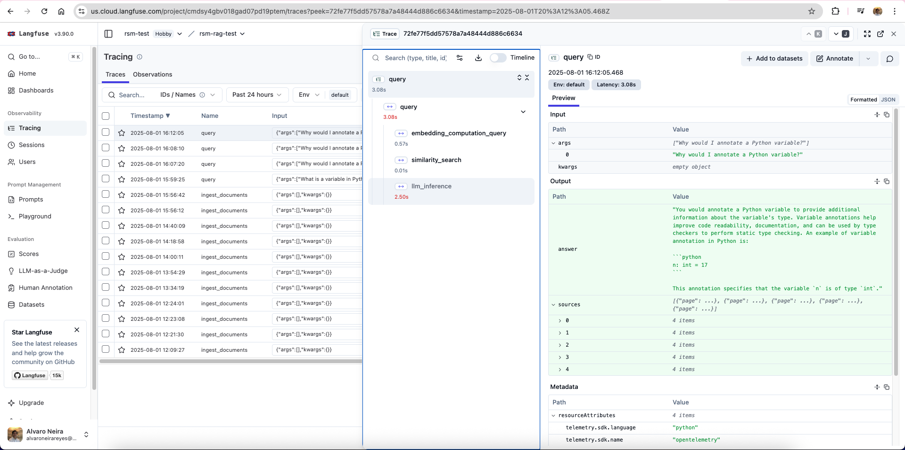

# RSM RAG Test Microservice with Langfuse Observability

**Author:** Alvaro Neira  
**Email:** alvaroneirareyes@gmail.com

### Prerequisites

- Python 3.11+ (I used 3.11.9)
- Docker & Docker Compose
- OpenAI API key
- Langfuse account

## How to deploy this service

```bash
git clone git@github.com:alvaro-neira/rsm-rag.git
cd rsm-rag

# Create .env file with the environment variables described in point 3
vim .env

# Build and start FastAPI server with Docker (Docker Desktop must be running)
docker compose up --build

# Access the API
curl http://localhost:8000/health
```


The FastAPI server can be run without docker:
```bash
# Create virtual environment
python -m venv venv
source venv/bin/activate

# Install dependencies
pip install -r requirements.txt

# Run the FastAPI server
python -m app.main
```

Note: you can't run both versions of the server at the same time.

## 1. Indexing

- **Engine**: Chroma (local, persistent). The reasons for using Chroma are its
simplicity and lightweight, compared to other alternatives such as Pinecone or FAISS.
- **Embedding Model**: OpenAI text-embedding-3-small (1536 dimensions)
- **Chunk Size**: 1000 characters with 200 character overlap

## 2. API Endpoints (FastAPI)

- `GET http://localhost:8000/health` → returns 200 OK.  
- `POST http://localhost:8000/ingest` → triggers the ingestion. The 2 documents ("Think Python" and "PEP 8") are automatically ingested when the service starts.
It doesn't accept any parameters. It returns:
```json
{
    "status": "success",
    "message": "Successfully ingested 616 documents",
    "total_documents": 616,
    "sources": {
        "Think Python": 556,
        "PEP 8": 60
    }
}
```
- `POST http://localhost:8000/query` → accepts:

  ```json
  { "question": "<text>" }
  ```

  and returns:

  ```json
  {
    "answer": "<generated answer>",
    "sources": [
      { "page": <number>, 
        "text": "<passage text>",
        "source": "<Thing Python | PEP 8>",
        "distance": "<the distance from the query embedding to the document embedding>"}
    ]
  }
  ```
Example:
```bash
curl -X POST http://localhost:8000/query -H "Content-Type: application/json" -d '{"question": "Why would I annotate a Python variable?"}'
```

Answer:
```json
{
    "answer": "You would annotate a Python variable to provide additional information about the variable's type. Variable annotations help improve code readability, maintainability, and can be used by type checkers to perform static type checking. An example of variable annotation in Python is:\n\n```python\nmessage: str = 'And now for something completely different'\n```\n\nBy annotating the variable `message` with `str`, you indicate that it is expected to hold a string type value. This can help other developers understand the intended usage of the variable and catch potential type-related errors early in the development process.",
    "sources": [
        {
            "page": 27,
            "text": "an arrow pointing to its value. This kind of figure is called a state diagram because it shows what state each of the variables is in (think of it as the variable’s state of mind).\nWe’ll use state dia...",
            "source": "Think Python",
            "distance": 0.9381792545318604
        },
        {
            "page": 26,
            "text": "Python creates the variable and gives it a value, but the assignment statement has no visible effect.\nHowever, after creating a variable, you can use it as an expression.\nSo we can display the value o...",
            "source": "Think Python",
            "distance": 0.9677622318267822
        },
        {
            "page": 56,
            "text": "reviewing how easy it was to add those annotations, and observing\nwhether their presence increases code understandability. The Python standard library should be conservative in adopting such\nannotatio...",
            "source": "PEP 8",
            "distance": 0.9823206663131714
        },
        {
            "page": 57,
            "text": "However, it is expected that users of third party library packages\nmay want to run type checkers over those packages.  For this purpose PEP 484 recommends the use of stub files: .pyi files that are re...",
            "source": "PEP 8",
            "distance": 0.9908217787742615
        },
        {
            "page": 25,
            "text": "And I’ll introduce more of the vocabulary we use to talk about programs, including “argument” and “module”. 2.1. Variables # A variable is a name that refers to a value.\nTo create a variable, we can w...",
            "source": "Think Python",
            "distance": 1.0334444046020508
        }
    ]
}
```
## 3. LLM Integration with LangChain

- Used OpenAI API because that API is the one that I am most familiar with. 
- Used LangChain and not LangGraph because the latter would have added unnecessary complexity for this project.
- The needed environment variables are set in the `.env` file:
  - OPENAI_API_KEY=...
  - LANGFUSE_PUBLIC_KEY=pk-...
  - LANGFUSE_SECRET_KEY=sk-...
  - LANGFUSE_HOST=https://....cloud.langfuse.com

## 4. Observability

### Langfuse Tracing
* Used Langfuse for observability and not LangSmith because the former allows explicit tracing control.
To see the instrumented spans, see them in https://cloud.langfuse.com/
Example:

### Structured Logging
The application emits structured JSON logs for all requests, errors, and significant events. All logs include:

**Standard Fields:**
- `timestamp`: UTC timestamp in ISO format
- `level`: Log level (INFO, ERROR, WARNING)
- `service`: Always "rsm-rag"
- `logger`: Module/component name (e.g., "rsm-rag.api", "rsm-rag.rag_service")
- `message`: Human-readable log message

**Event Types:**
- `request`: Incoming HTTP requests
- `response`: HTTP responses with timing
- `query_started`: RAG query processing begins
- `query_completed`: RAG query processing completed
- `document_ingestion_started`: Document ingestion begins
- `document_ingestion_completed`: Document ingestion completed
- `error`: Error occurred with context

**Example:**

```json
{
  "timestamp": "2025-08-01T01:17:41.456Z",
  "level": "ERROR",
  "service": "rsm-rag",
  "logger": "rsm-rag.rag_service",
  "message": "Error occurred: OpenAI API rate limit exceeded",
  "event_type": "error",
  "error_type": "RateLimitError",
  "error_message": "OpenAI API rate limit exceeded",
  "operation": "rag_query",
  "question": "What is a variable?",
  "exception": "Traceback (most recent call last)..."
}

```
### System Metrics
The application exposes other metrics for monitoring and alerting at `/metrics` endpoint:

**HTTP Request Metrics:**
- `http_requests_total` - Total HTTP requests by method, endpoint, and status code
- `http_request_duration_seconds` - Request latency histogram with buckets
- `http_requests_in_progress` - Currently active HTTP requests

**RAG Business Metrics:**
- `rag_queries_total{status="success|error"}` - Total RAG queries processed
- `rag_query_duration_seconds` - RAG query processing time histogram
- `rag_sources_found` - Distribution of sources found per query

**Document Processing Metrics:**
- `document_ingestion_total{status="success|error"}` - Document ingestion operations
- `document_ingestion_duration_seconds` - Ingestion processing time
- `documents_processed_total` - Total documents processed counter

**Vector Store Metrics:**
- `vector_store_operations_total{operation="add|search", status="success|error"}` - Vector store operations
- `vector_store_collection_size` - Current number of documents in collection

**Embedding Metrics:**
- `embeddings_generated_total{type="document|query"}` - Total embeddings generated
- `embedding_generation_duration_seconds{type="document|query"}` - Embedding generation time

**Error Metrics:**
- `errors_total{error_type, operation}` - Error counts by type and operation

**Usage:**\
Go to http://localhost:8000/metrics

**Prometheus** and **Grafana** are included in the Docker Compose setup for easy monitoring and visualization of these metrics:
* Prometheus: http://localhost:9090
* Grafana: http://localhost:3000 (User: admin/ Pass: admin)

(Only if the FastAPI server is run with Docker)

These tools were chosen for their ease of use and integration with Python applications. Also, they are open source and widely adopted in the industry.
### Create Useful Queries In Prometheus (http://localhost:9090):

**1. Query Processing Rate:**
```promql
rate(rag_queries_total[5m])
```

**2. Average Query Duration:**
```promql
rate(rag_query_duration_seconds_sum[5m]) / rate(rag_query_duration_seconds_count[5m])
```

**3. Request Error Rate:**
```promql
rate(http_requests_total{status_code!="200"}[5m]) / rate(http_requests_total[5m])
```

**4. 95th Percentile Response Time:**
```promql
histogram_quantile(0.95, rate(http_request_duration_seconds_bucket[5m]))
```
Example of the last query:
* 

### Set Up Grafana Dashboard

### 1. Access Grafana:
- Go to http://localhost:3000
- Login: admin/admin
- Change password when prompted

### 2. Add Prometheus Data Source:
- Click "Add data source"
- Select "Prometheus"
- URL: `http://prometheus:9090`
- Click "Save & Test"

### 3. Create RAG Dashboard:

**Create panels for:**

**Panel 1: RAG Queries per Second**
```promql
rate(rag_queries_total[1m])
```

**Panel 2: Average Query Duration**
```promql
rate(rag_query_duration_seconds_sum[5m]) / rate(rag_query_duration_seconds_count[5m])
```

**Panel 3: Average Request Duration by Endpoint**
```promql
rate(http_request_duration_seconds_sum[5m]) / rate(http_request_duration_seconds_count[5m])
```

**Panel 4: Error Rate**
```promql
(rate(http_requests_total{status_code!="200"}[5m]) / rate(http_requests_total[5m])) * 100
```

Example:
* 

## Testing
```bash
# Create virtual environment if you haven't already
python -m venv venv
source venv/bin/activate

# Create virtual environment if you haven't already
pip install -r requirements.txt

# Install test dependencies
pip install pytest pytest-mock

# Run the FastAPI server if you haven't already (docker or directly with Python)

# Run tests (unit tests, integration tests, end-to-end tests)
pytest -v
```

